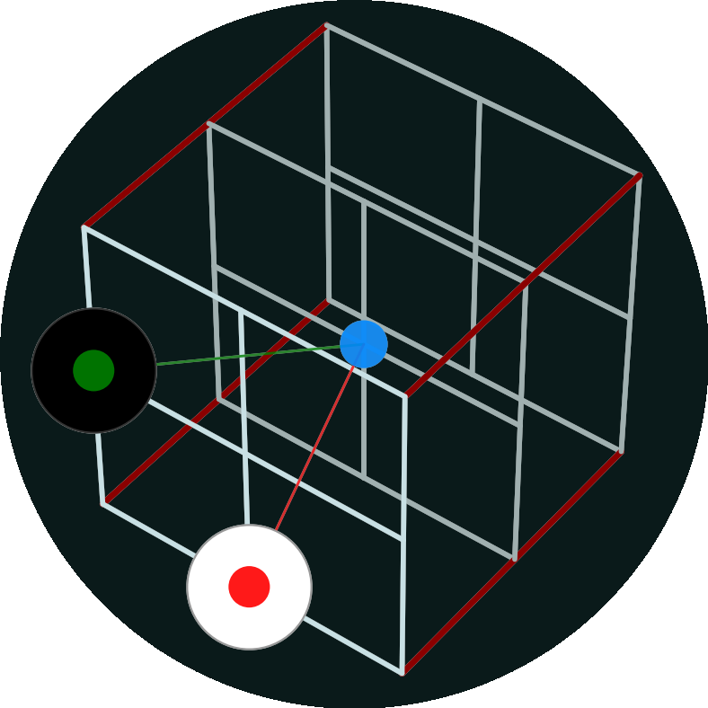

# Gomoku 613B-E2D

<p align="center">
  
</p>

<h1 align="center">Gomoku 613B-E2D</h1>
<p align="center"><strong>离散视角的三维（拓展二维）五子棋</strong></p>
<p align="center">v0.6.4 · <a href="https://github.com/phixt/gomoku-613B-E2D">GitHub</a></p>

---

## 📖 游戏简介

**Gomoku 613B-E2D** 是一款基于离散视角的三维五子棋游戏。你将在一个由 **6 层 × 13×13 棋盘**（可自定义）构成的三维空间中下棋。项目采用双面板架构，将 2D 正交落子界面与 3D 透视沙盘完美融合，提供极具深度的空间博弈体验。

> 几乎纯 vibe coding。

---

## ⚠️ 重要提示

> **游戏开始后，由于初始 3D 视角设定较近，请先按下 `S` 键将左视图拉远（缩小 FOV），即可看到完整的棋盘图形。**

---

## 🎮 游戏介绍

### 核心概念

- **三维棋盘**：棋子在 XYZ 三个维度上排列，连珠线可以是水平、垂直、对角甚至跨越不同层级的斜线。
- **双面板架构**：左侧 3D 透视图提供全局空间感知，右侧 2D 正交图聚焦当前层级，实现精确落子。
- **离散视角**：棋盘按层级（Z 轴）分割，每次聚焦一个平面进行落子操作。

### 游戏要素

| 要素 | 说明 |
| :--- | :--- |
| **棋盘** | 默认 13×13×6，可自定义尺寸（奇数边长）、层数及连珠数（4‑9 子） |
| **棋子** | 黑方（先手）/ 白方（后手）交替落子 |
| **层级** | Z 轴 0‑5 层，每层一个 13×13 正交网格 |
| **层间距** | 可动态调整（2.0‑6.0），控制 3D 空间的视觉压缩程度 |

### 胜负判定

- 在任意方向（水平、垂直、对角、跨层斜线）上率先形成**连续 N 子**（默认 5 子，可配置）的一方获胜。
- 支持 **Standard**（标准）、**SWAP2** 两种开局规则，确保对局公平性。
- 全棋盘落满且无人获胜时判为平局。

### AI 对战

- 内置 AI 对手，支持先手/后手选择。
- 自适应所有棋盘规格。

### 存档系统

- 提供 6 个存档槽位，支持手动存档/读档。
- 自动快存功能（槽位 6）。
- 支持复盘回放。

---

## ⌨️ 操作指南

### 3D 空间与视角

| 按键 | 功能 |
| :--- | :--- |
| **`Q` / `E`** | 旋转 3D 视角（绕 Y 轴） |
| **`W` / `S`** | 推拉 3D 视角（缩放/聚焦） |
| **`Z` / `C`** | 调整层间距（压缩 / 拉大 3D 空间） |
| **`X`** | 层间距复位 / 回到刚才的层间距 |

> 默认层间距 3.5，调整范围 2.0‑6.0。

### 层级与平面

| 按键 | 功能 |
| :--- | :--- |
| **`A` / `D`** | 切换焦点层级（循环 0‑5 层） |
| **`F`** | 翻转 2D 主战场（水平镜像） |

### 显示与对弈

| 按键 / 操作 | 功能 |
| :--- | :--- |
| **`T`** | 切换亮色/暗色主题 |
| **`H`** | 开启/关闭辅助线 |
| **`V`** | 开启/关闭色弱模式（辅助线：红/绿 → 黄/蓝） |
| **鼠标悬停** | 查看 2D/3D 辅助线（己方绿/蓝，敌方红/黄）及蓝色定位点（左视图） |
| **鼠标点击** | 在当前焦点层落子 |

---

## ✨ 核心特性

- **双面板协同架构**：左侧 3D 透视视图提供全局空间感知，右侧 2D 正交视图提供精准落子操作。
- **辅助线系统**：支持 2D/3D 联动渲染，采用红绿/黄蓝差分着色（己方绿/蓝色，敌方红/黄色），严格限制 4 格检测范围以优化性能和减少干扰。
- **微观空间控制**：支持动态调整层间距（Z/C），赋予玩家对 3D 空间拓扑的绝对掌控力。
- **水绿宣纸视觉**：采用霞鹜文楷字体，搭配水绿渐变与工程图纸风格的开始界面。
- **桌面端原生支持**：基于 Tauri 构建，可打包为开箱即用的 Windows 安装包，无浏览器滚动条干扰，体验纯粹。
- **多语言支持**：内置简体中文、繁体中文、英文、日文。
- **棋盘规模自定义**：可调整棋盘尺寸、层数及连珠数（4‑9 子）。
- **SWAP2 开局规则**：提供更公平的竞技开局选择。

---

## 📂 项目结构

```
gomoku-613B-E2D/
├── public/
│   ├── fonts/
│   │   └── LXGWWenKaiLite-Regular.woff2   # 霞鹜文楷内嵌字体
│   ├── favicon.svg                         # 应用图标
│   └── icons.svg
├── src/
│   ├── ai/
│   │   ├── IAIEngine.ts                    # AI 引擎接口
│   │   └── AIEngine.ts                     # AI 落子实现
│   ├── assets/
│   │   ├── audio/
│   │   │   └── bgm/                        # 背景音乐资源
│   │   ├── hero.png
│   │   ├── typescript.svg
│   │   └── vite.svg
│   ├── audio/
│   │   └── AudioManager.ts                 # 音频管理器（BGM + 音效）
│   ├── core/
│   │   ├── rules/
│   │   │   ├── IRuleEngine.ts              # 规则引擎接口
│   │   │   ├── StandardEngine.ts           # 标准五子棋规则
│   │   │   └── SwapEngine.ts               # SWAP/SWAP2 开局规则
│   │   ├── Board.ts                        # 三维棋盘数据模型（Uint8Array）
│   │   ├── Config.ts                       # 全局配置常量
│   │   ├── EventBus.ts                     # 事件总线（发布/订阅）
│   │   ├── GameStore.ts                    # 全局游戏状态管理
│   │   ├── I18n.ts                         # 多语言国际化
│   │   ├── LevelManager.ts                 # 关卡管理
│   │   ├── LocalStorageAdapter.ts          # 浏览器端持久化适配器
│   │   ├── Rules.ts                        # 规则判决（胜负检测）
│   │   ├── SaveManager.ts                  # 存档管理器（6 个槽位）
│   │   ├── StorageAdapter.ts               # 持久化抽象接口
│   │   ├── TauriStoreAdapter.ts            # Tauri 原生存储适配器
│   │   └── Types.ts                        # 核心类型定义 & 主题配色
│   ├── locales/
│   │   ├── en-US.ts                        # 英文
│   │   ├── ja-JP.ts                        # 日文
│   │   ├── zh-CN.ts                        # 简体中文
│   │   └── zh-Hant.ts                      # 繁体中文
│   ├── styles/
│   │   ├── animations.css                   # 动画样式
│   │   ├── base.css                         # 基础 / 重置样式
│   │   ├── components.css                   # 组件样式
│   │   ├── layout.css                       # 布局样式
│   │   └── panels.css                       # 面板样式
│   ├── ui/
│   │   └── OverlayManager.ts               # UI 覆盖层管理（弹窗/HUD）
│   ├── utils/
│   │   ├── MathUtils.ts                     # 数学工具函数
│   │   └── ResourceManager.ts              # 资源加载管理
│   ├── views/
│   │   ├── LeftPanel.ts                    # 左面板（3D 透视图）
│   │   └── RightPanel.ts                   # 右面板（2D 正交图 + 落子操作）
│   ├── main.ts                             # 应用入口
│   └── vite-env.d.ts
├── src-tauri/
│   ├── src/
│   │   ├── lib.rs                          # Tauri Rust 库
│   │   └── main.rs                         # Tauri Rust 入口
│   ├── icons/                              # 多平台应用图标
│   └── Cargo.toml                          # Rust 依赖配置
├── docs/
│   └── audio_var.md                        # 音频变量说明
├── pics/                                   # 截图 & 宣传图
│   ├── icon-source.png
│   └── uninstaller.png
├── index.html                              # Vite 入口 HTML
├── package.json
├── tsconfig.json
├── vite.config.ts
└── README.md
```

---

## 🛠️ 技术栈

- **前端核心**：TypeScript, Three.js, Vite
- **桌面端框架**：Tauri (Rust)
- **字体支持**：LXGW WenKai (霞鹜文楷)

---

## 🚀 构建与运行

### 开发环境

```bash
# 安装依赖
npm install

# 启动 Vite 开发服务器
npm run dev

# 启动 Tauri 桌面端调试
npm run tauri dev
```

### 生产打包 (Windows)

```bash
# 前端构建
npm run build

# 打包为 Windows 安装包 (NSIS)
npm run tauri build
```

*打包产物位于 `src-tauri/target/release/bundle/nsis/` 目录下。*

---

## 📜 版本演进

- **v0.1.x**：完成双面板架构搭建，实现正交/透视相机分离、A/D 换层、Q/E 旋转。
- **v0.2.0**：引入主题系统 (T)、H 键辅助线开关、开始界面 UI 重构。
- **v0.2.1**：修复 Tauri v2 打包配置，实现 Windows exe 稳定交付，控制台零警告。
- **v0.3.0**：重构辅助线逻辑（4 格限制、红绿差分、Z 轴层级修正），实现 3D 蓝点联动。
- **v0.3.1**：解锁 Z/C 层间距动态缩放，实现 W/S 视角完全解耦，引入 MathUtils 公共逻辑库。
- **v0.3.2**：引入霞鹜文楷字体，优化 UI 体验，开始界面样式变更。
- **v0.3.2-fix**：紧急修复右视图安全边距。
- **v0.4.0**：增加存档读档功能，调整开始界面布局。
- **v0.4.1**：图标重绘，引入色弱模式（V）。
- **v0.5.0**：引入桌面端/网页端双端架构，修改卸载图标。
- **v0.6.0**：色弱模式全局生效，AI 落子，AI 模式先后手添加。
- **v0.6.1**：音乐调整为和弦循环；存档功能重构，支持复盘，覆写功能修改。
- **v0.6.2**：音乐更加丰富，增加英文/日语支持。
- **v0.6.3**：增加关卡，增加繁体中文。默认内嵌字体，而非 CDN 加载。
- **v0.6.4**：棋盘规模自定义；样式清除冗余部分；AI 自适应接入所有游戏规模；添加 SWAP2 规则；五子拓展为多子（4‑9）。

---

## 🔮 预计上线功能 / 优化

- **补全音乐**
- ~~**切换语言**~~（已完成）
- ~~**存档优化，逐步记录**~~（已完成）

---

> 本游戏遵循开源协议MIT，欢迎 Star、Fork 和贡献！  
> 项目地址：[https://github.com/phixt/gomoku-613B-E2D](https://github.com/phixt/gomoku-613B-E2D)
